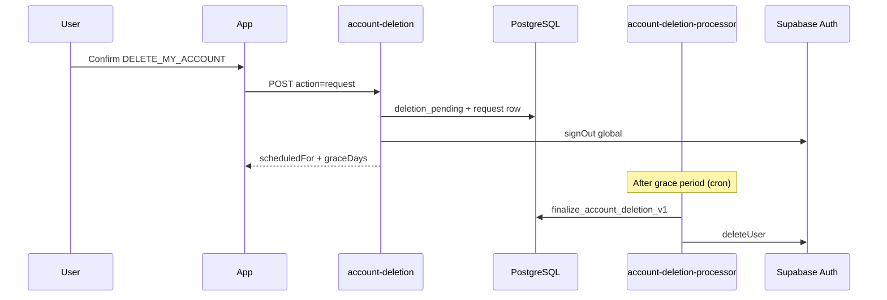

# HOPE TV privacy and account lifecycle (Phase 7)

## Customer-facing surfaces

| Surface | Capability |
|---|---|
| Flutter app (Account screen) | Request deletion, view pending status, cancel during grace period |
| Customer portal (Phase 4+) | Same deletion API via `account-deletion` Edge Function |
| IPTV credentials | Remain in local secure storage until user disconnects in Settings |

## Deletion workflow

## Legal and policy artifacts (owner-authored)

Before production launch, publish:

- Privacy policy
- Terms of service
- Subscription, renewal, cancellation, and refund terms
- Acceptable-use policy
- Copyright/takedown policy
- Support contact and process

This repository documents **technical** retention and deletion behavior only. Legal text is not generated here.

## Processor integrations

When billing is configured, the deletion request path should:

1. Direct users to cancel renewal via the approved customer portal flow, or
2. Require `acknowledgeSubscriptionLoss: true` if an active subscription remains.

Processor deletion requests (payment provider, email vendor) are manual or scripted follow-ups documented in the operations runbook.

## Audit trail

Deletion events append to `private.audit_logs` with actions:

- `account.deletion.requested`
- `account.deletion.canceled`
- `account.deletion.completed` (non-identifying hash prefix only)
