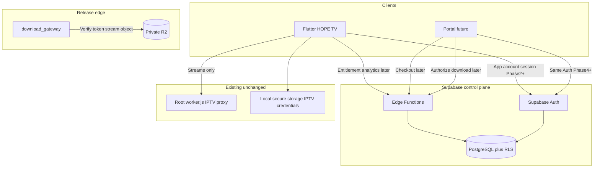

# HOPE TV commercial threat model (Phase 0/1)

## Data-flow overview

## Assets

| Asset | Sensitivity | Authority |
|---|---|---|
| App account identity / JWT | High | Supabase Auth |
| Trial and subscription state | High | PostgreSQL via Edge Functions |
| Entitlement signing private key | Critical | Backend secrets only |
| IPTV provider credentials | Critical | Flutter secure storage only |
| Release binaries | High | Private R2 + download gateway |
| Billing provider secrets | Critical | Deferred; Edge Function secrets when configured |

## Primary threats and mitigations

| Threat | Mitigation |
|---|---|
| Client forges `isPremium` | Server entitlement + signed offline lease; no client flag as source of truth |
| Reinstall resets trial | One trial per verified account; server timestamps |
| Clock rollback extends access | Trusted server time; lease expiry; deny when integrity fails |
| Cross-account data read | Deny-by-default RLS; RLS tests |
| Service-role leak in client | Never ship service-role; audit client artifacts later |
| Commercial secrets in IPTV Worker | Isolated download gateway + Edge Functions (ADR 0004) |
| Checkout without provider | NotConfigured BillingProvider fails closed |
| Analytics leaks IPTV URLs/credentials | Allowlisted events; strip forbidden properties (Phase 5) |
| Account deletion incomplete | Grace-period workflow; processor finalizes anonymization; auth user removed after SQL finalize |
| Retention drift | `private.data_retention_policies` + scheduled `purge_expired_raw_data_v1` |
| Public release URLs | Private R2; short-lived tokens when automation lands |
| WebView / in-app card capture | Forbidden; external browser only when billing exists |

## Trust boundaries

1. **Device** — untrusted; binaries can be patched. Server remains authority.
2. **Flutter / portal** — hold only publishable Supabase key + public verification keys.
3. **Edge Functions (service role)** — trusted for mutations; least privilege per function.
4. **Download gateway** — trusts Supabase JWKS / short-lived download tokens; private R2 binding.
5. **IPTV proxy** — untrusted for commercial data; must remain free of control-plane secrets.

## Out of scope for Phase 1

- Live payment fraud analysis.
- Full admin MFA portal.
- Production key rotation drills (documented as follow-up).

## Phase 7 additions

- Account deletion with grace period, session revocation, and anonymization (`docs/commercial/PRIVACY_LIFECYCLE.md`).
- Retention enforcement via `analytics.purge_expired_raw_data_v1`.
- Scheduled deletion processor protected by `CRON_SECRET`.
- Admin health surfaces deletion queue depth and retention policy registry.
